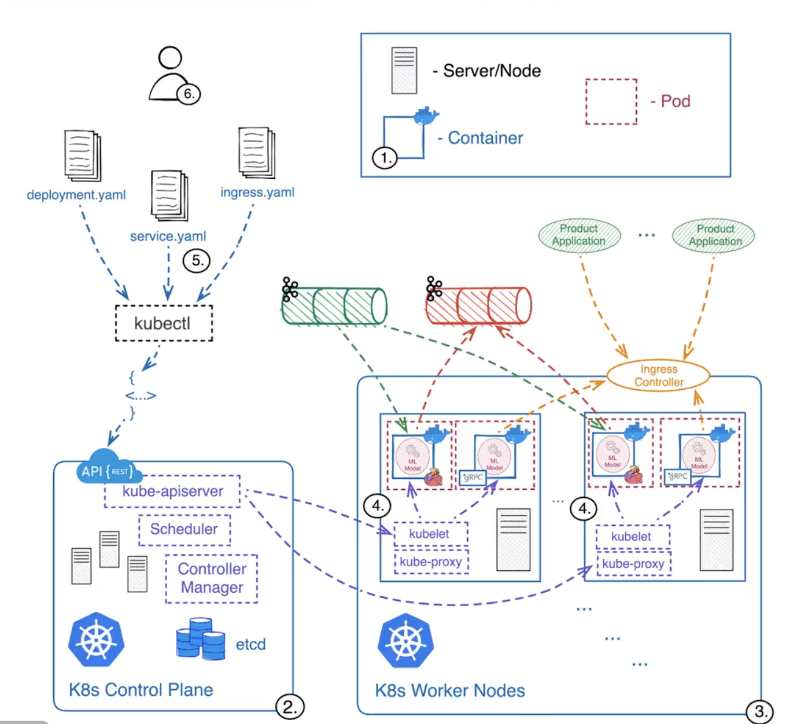

# Docker & Kubernetes

# Underline Technology
## OverlayFS
In computing, OverlayFS is a union mount filesystem implementation for Linux. It combines multiple different underlying mount points into one, resulting in single directory structure that contains underlying files and sub-directories from all sources.

```bash
mkdir lowerdir upperdir
echo "Hello from lowerdir" > lowerdir/file.txt
echo "Hello from upperdir" > upperdir/file.txt
sudo mount -t overlay overlay -o lowerdir=lowerdir,upperdir=upperdir,workdir=workdir mergeddir
cat mergeddir/file.txt
sudo umount mergeddir
```


## Linux Namespace

### Mount namespaces
### UTS namespaces
### IPC namespaces
### PID namespaces
### Network namespaces
### User namespaces

## Open Container Initiative Runtime Specification
The Open Container Initiative Runtime Specification aims to specify the configuration, execution environment, and lifecycle of a container.

A container's configuration is specified as the config.json for the supported platforms and details the fields that enable the creation of a container. The execution environment is specified to ensure that applications running inside a container have a consistent environment between runtimes along with common actions defined for the container's lifecycle.

### Container Principles
Define a unit of software delivery called a standard container.
The specification for Standard container defines:
1. configuration file formats;
2. a set of standard operations;
3. an execution environment.

The 5 principles of Standard Containers are:
1. Standard operations
2. Content-agnostic
3. Infrastructure-agnostic
4. Designed for automation
5. Industrial-grade delivery

## Container Network Interface


CNI proposes a generic plugin-based networking solution for application containers on linux.
* container is a network isolation domain, though the actual isolation technology is not defined by the specification. This could be a network namespace or a virtual machine, for example.

* network refers to a group of endpoints that are uniquely addressable that can communicate amongst each other. This could be either an individual container (as specified above), a machine, or some other network device (e.g. a router). Containers can be conceptually added to or removed from one or more networks.
* runtime is the program responsible for executing CNI plugins.
* plugin is a program that applies a specified network configuration.

CNI specification defines:
1. A format for administrators to define network configuration.
2. A protocol for container runtimes to make requests to network plugins.
3. A procedure for executing plugins based on a supplied configuration.
4. A procedure for plugins to delegate functionality to other plugins.
5. Data types for plugins to return their results to the runtime.
 
# Docker
## Docker Engine

### Docker Network
#### Docker Network Overview

 Container networking refers to the ability for containers to connect to and communicate with each other, or to non-Docker workloads.

 A container has no information about what kind of network it's attached to, or whether their peers are also Docker workloads or not. A container only sees a network interface with an IP address, a gateway, a routing table, DNS services, and other networking details. That is, unless the container uses the none network driver.

##### Published ports
##### Ip address and hostname

By default, the container gets an IP address for every Docker network it attaches to. A container receives an IP address out of the IP subnet of the network. The Docker daemon performs dynamic subnetting and IP address allocation for containers. Each network also has a default subnet mask and gateway.

#### Network Drivers

Docker's networking subsystem is pluggable, using drivers.

##### bridge
##### host
##### overlay
##### ipvlan
##### macvlan
##### none
##### network plugins

### Docker Storage

By default all files created inside a container are stored on a writable container layer. This means that:

* The data doesn't persist when that container no longer exists, and it can be difficult to get the data out of the container if another process needs it.
* A container's writable layer is tightly coupled to the host machine where the container is running. You can't easily move the data somewhere else.
* Writing into a container's writable layer requires a storage driver to manage the filesystem. The storage driver provides a union filesystem, using the Linux kernel. This extra abstraction reduces performance as compared to using data volumes, which write directly to the host filesystem.

Docker has two options for containers to store files on the host machine, so that the files are persisted even after the container stops: volumes, and bind mounts.


#### Volumes


#### Bind Mounts


#### Tmpfs mounts


#### Storage Drivers


## Docker Build


### Building Images

#### Dockfile
There is a dockfile reference

#### Docker Images
1. packaging your software
2. build context
3. multi-stage builds
4. multi-platform images
5. enviroment viraables
6. create your own base image

## Docker Compose
Compose is a tool for defining and running multi-container Docker applications. With Compose, you use a YAML file to configure your application's services. Then, with a single command, you create and start all the services from your configuration.

### Key features and use cases of Docker Compose
Using Compose is essentially a three-step process:
1. Define your app's environment with a Dockerfile so it can be reproduced anywhere.
2. Define the services that make up your app in a compose.yaml file so they can be run together in an isolated environment.
3. Run docker compose up and the Docker compose command starts and runs your entire app.

## Kubernetes
Kubernetes, also known as K8s, is an open-source system for automating deployment, scaling, and management of containerized applications.



### Why Kubernetes


#### Benefits
* Service discovery and load balancing
* Storage orchestration
* Automated rollouts and rollbacks
* Automatic bin packing
* Self-healing
* Secret and configuration management

### Kubernetes Components


#### Control Plane Componets
The control plane's components make global decisions about the cluster (for example, scheduling), as well as detecting and responding to cluster events (for example, starting up a new pod when a deployment's replicas field is unsatisfied).

##### kube-apiserver
The API server is a component of the Kubernetes control plane that exposes the Kubernetes API. The API server is the front end for the Kubernetes control plane.

##### etcd
Consistent and highly-available key value store used as Kubernetes' backing store for all cluster data.

##### kube-scheduler
Control plane component that watches for newly created Pods with no assigned node, and selects a node for them to run on.

##### kube-controller-manager
Control plane component that runs controller processes.

##### cloud-controller-manager
A Kubernetes control plane component that embeds cloud-specific control logic.

#### Node Components

##### kubelet
An agent that runs on each node in the cluster. It makes sure that containers are running in a Pod.

##### kubelet basics
The common format of a kubectl command is: kubectl action resource.

##### kube-proxy
kube-proxy is a network proxy that runs on each node in your cluster, implementing part of the Kubernetes Service concept.

##### Contain runtime
A fundamental component that empowers Kubernetes to run containers effectively. It is responsible for managing the execution and lifecycle of containers within the Kubernetes environment.

#### Addons
Addons use Kubernetes resources (DaemonSet, Deployment, etc) to implement cluster features. Because these are providing cluster-level features, namespaced resources for addons belong within the kube-system namespace.

1. DNS
2. Web UI(Dashboard)
3. Container Resource Monitoring
4. Cluster-Level Logging
5. Network Plugins

### Nodes

Kubernetes runs your workload by placing containers into Pods to run on Nodes. A node may be a virtual or physical machine, depending on the cluster. Each node is managed by the control plane and contains the services necessary to run Pods.

#### Management
There are two main ways to have Nodes added to the API server:

1. The kubelet on a node self-registers to the control plane
2. You (or another human user) manually add a Node object

#### Node name uniqueness


### Controllers
In robotics and automation, a control loop is a non-terminating loop that regulates the state of a system.

In Kubernetes, controllers are control loops that watch the state of your cluster, then make or request changes where needed. Each controller tries to move the current cluster state closer to the desired state.

#### Controller pattern

##### Control via API server

#### Pods 


#### Service
Kubernetes Pods are mortal. Pods have a lifecycle.

A Service in Kubernetes is an abstraction which defines a logical set of Pods and a policy by which to access them. Services enable a loose coupling between dependent Pods. A Service is defined using YAML or JSON, like all Kubernetes object manifests.

Although each Pod has a unique IP address, those IPs are not exposed outside the cluster without a Service.

##### Service and Labels
A Service routes traffic across a set of Pods. Services are the abstraction that allows pods to die and replicate in Kubernetes without impacting your application. Discovery and routing among dependent Pods (such as the frontend and backend components in an application) are handled by Kubernetes Services.

Services match a set of Pods using labels and selectors, a grouping primitive that allows logical operation on objects in Kubernetes. Labels are key/value pairs attached to objects and can be used in any number of ways:

* Designate objects for development, test, and production
* Embed version tags
* Classify an object using tags


### Performing Action
#### Create a Cluster
It's easy to create a cluster using minikuba

#### Deploy an App
#### Explore your App
#### Expose your App Publicly
#### Scale Your App
#### Update Your App

##### Performing a Rolling Update
###### Updating an application
Users expect applications to be available all the time and developers are expected to deploy new versions of them several times a day.
Rolling updates allow Deployments' update to take place with zero downtime by incrementally updating Pods instances with new ones. The new Pods will be scheduled on Nodes with available resources.Rolling updates allow Deployments' update to take place with zero downtime by incrementally updating Pods instances with new ones. The new Pods will be scheduled on Nodes with available resources.

