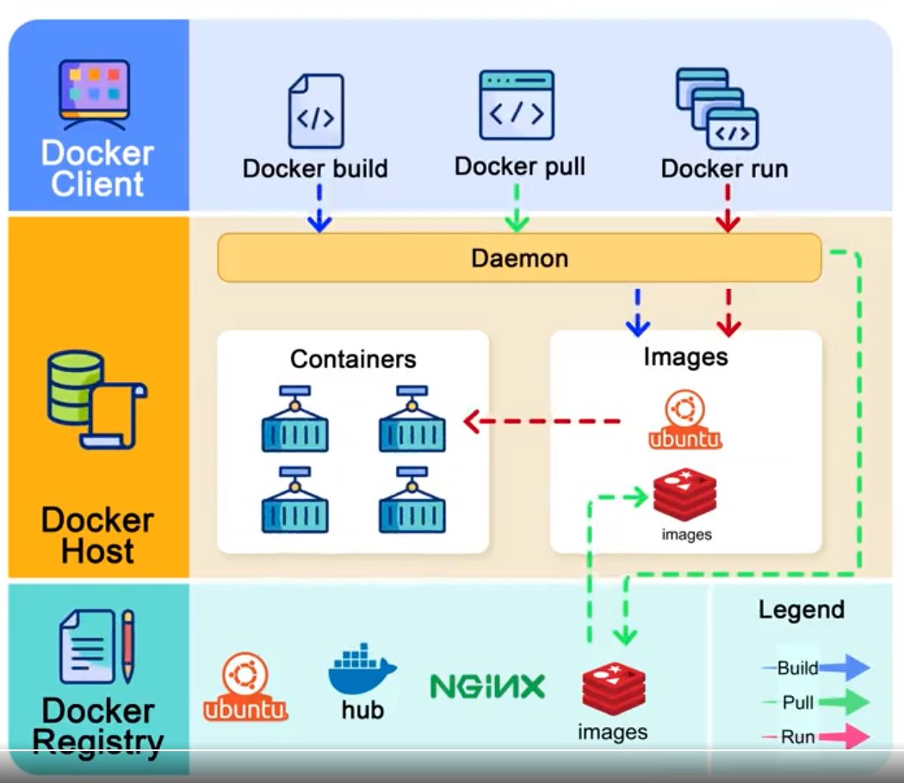

# Docker & Kubernetes

# Docker

## Docker Engine

### Docker Network
#### Docker Network Overview

 Container networking refers to the ability for containers to connect to and communicate with each other, or to non-Docker workloads.

 A container has no information about what kind of network it's attached to, or whether their peers are also Docker workloads or not. A container only sees a network interface with an IP address, a gateway, a routing table, DNS services, and other networking details. That is, unless the container uses the none network driver.

##### Published ports
##### Ip address and hostname

By default, the container gets an IP address for every Docker network it attaches to. A container receives an IP address out of the IP subnet of the network. The Docker daemon performs dynamic subnetting and IP address allocation for containers. Each network also has a default subnet mask and gateway.

#### Network Drivers

Docker's networking subsystem is pluggable, using drivers.

##### bridge
##### host
##### overlay
##### ipvlan
##### macvlan
##### none
##### network plugins

### Docker Storage

By default all files created inside a container are stored on a writable container layer. This means that:

* The data doesn't persist when that container no longer exists, and it can be difficult to get the data out of the container if another process needs it.
* A container's writable layer is tightly coupled to the host machine where the container is running. You can't easily move the data somewhere else.
* Writing into a container's writable layer requires a storage driver to manage the filesystem. The storage driver provides a union filesystem, using the Linux kernel. This extra abstraction reduces performance as compared to using data volumes, which write directly to the host filesystem.

Docker has two options for containers to store files on the host machine, so that the files are persisted even after the container stops: volumes, and bind mounts.

#### Volumes

#### Bind Mounts

#### Tmpfs mounts

#### Storage Drivers

## Docker Build

### Building Images

#### Dockfile
There is a dockfile reference

#### Docker Images
1. packaging your software
2. build context
3. multi-stage builds
4. multi-platform images
5. enviroment viraables
6. create your own base image

## Kubernetes
Kubernetes, also known as K8s, is an open-source system for automating deployment, scaling, and management of containerized applications.

### Why Kubernetes

#### Benefits
* Service discovery and load balancing
* Storage orchestration
* Automated rollouts and rollbacks
* Automatic bin packing
* Self-healing
* Secret and configuration management

### Kubernetes Components

