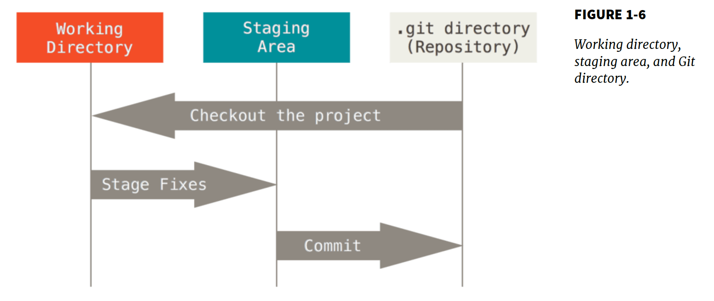
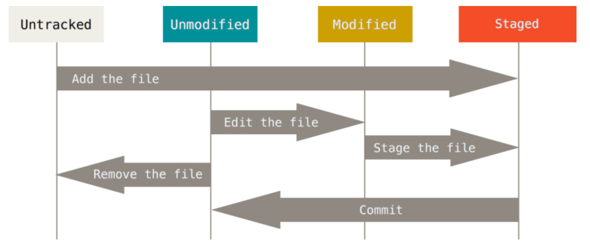

# Git

## 版本控制的历史

Local Version Control Systems --> Centralized Version Control Systems(svn) --> Distributed Version Control Systems(git).

In DVCS, clients don't just check out the latest snapshot of the files: they fully mirror the repository.

The three states:

 

## git工作流程

git管理文件的状态变迁

## 分支（branch）
